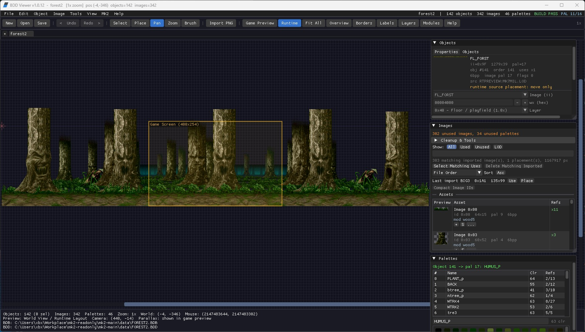

# midway-bddtool

`midway-bddtool` is a cross-platform viewer, editor, and research tool for
Midway BDB/BDD background data. It focuses on background layout, palette use,
block-image editing, and MK2-style LOAD2 authoring checks.



This public repository contains code, documentation, and the README screenshot
only. It intentionally does not include ROMs, proprietary game assets, stock
BDB/BDD files, IMG libraries, MAME nvram/cfg state, generated stage proofs, or
private source drops. Use your own legally obtained assets and keep local
working material in ignored folders such as `.local-private/`, `tmp/`, or
`reference/`.

## Highlights

- SDL2 background viewer with zoom, pan, game-preview layout, minimap, rulers,
  grids, object labels, layer filters, and composite PNG export.
- ImGui editor for BDB object placement, BDD images, palettes, module bounds,
  notes, ordering, copy/paste, undo/redo, and safe save backups.
- PNG and paletted TGA import/export, batch import, pixel editing with
  contrast backdrops, palette editing, thumbnail browsing, static-background
  placement, and unused-image cleanup.
- Midway IMG import from user-supplied `.IMG` files, folders, or LOAD2 `.LOD`
  lists, including frame metadata and anipoints persisted in sidecar metadata.
- MK2 authoring helpers for LOAD2-style module validation, X-major ordering,
  stage readiness, ROM-space budgeting, dormant asset inspection, palette
  analysis, and over-allocation relief suggestions.
- Headless smoke commands for BDB/BDD round-trips, generated proof stages, IMG
  import, LOD import, and open-mode checks.

## Public Asset Policy

Do not commit:

- ROM zips, split ROM chips, or generated program/video/sound ROM products.
- Stock or extracted game assets: `.BDB`, `.BDD`, `.IMG`, `.LOD`, `.IRW`,
  `.ROM`, `.SND`, `.CMP`, frame/header dumps, and similar files.
- MAME `cfg`, `nvram`, additional screenshots, capture output, or local proof
  bundles.
- Private stage art, PSDs, generated composites, or experiment snapshots.
- Decompiled/source-drop material from external game toolchains.

The repo keeps `.local-private/` ignored for quarantine and local-only work.
The `reference/` tree is also ignored except for short placeholder notes, so
you can recreate private stage kits and captures there without publishing them.
`screenshot.jpg` is the only checked-in JPG and exists as README/release media.

Important: removing files in a new commit does not erase them from earlier Git
history. Before pushing this repository to a public remote, publish from a
history-scrubbed branch or a fresh export that never contained private assets.

## Building

### Linux

```bash
sudo apt install libsdl2-dev cmake
cmake -B build
cmake --build build
./build/bddview <file.BDB>
```

### macOS

```bash
brew install sdl2 cmake
cmake -B build -DSDL2_DIR=$(brew --prefix sdl2)/cmake
cmake --build build
./build/bddview <file.BDB>
```

### Windows

```powershell
powershell -ExecutionPolicy Bypass -File build.ps1
```

The Windows helper downloads SDL2 into the local build cache when needed and
writes the release executable under `%LOCALAPPDATA%\bddview-build\`.

## Releases

Tagged releases are built by GitHub Actions. Pushing a `v*` tag publishes a
GitHub release with zip packages for Linux, macOS, and a checked-out source
archive. The tag version is passed into CMake, so `BDD Viewer vX.Y.Z`, the
About dialog, and Windows executable metadata match the release tag.

## Usage

```text
bddview
bddview <file.BDB>
bddview <file.BDD>
bddview --check-open-mode FILE [game-preview|image-grid]
bddview --roundtrip-save FILE OUT_PREFIX
bddview --import-png-smoke FILE.PNG OUT_PREFIX
bddview --import-img-smoke FILE.IMG OUT_PREFIX
bddview --import-img-folder-smoke DIR OUT_PREFIX
bddview --import-lod-smoke FILE.LOD OUT_PREFIX
bddview --write-bg-proof BGPROF
bddview --write-checker-test CHECKER
bddtool validate FILE.BDB [FILE.BDD]
python tools/roundtrip_smoke.py
```

Opening a `.BDB` automatically loads the matching `.BDD` when present. Opening
a standalone `.BDD` shows an image-grid workflow unless a companion `.BDB`
exists. Saves create backups before overwriting the active BDB/BDD pair.

The generated `BGPROF` and checker commands create synthetic test data. They
are useful for validating format handling without shipping proprietary assets.

## Working With User-Supplied MK2 Data

Advanced MK2 workflows require an external, legally obtained local toolchain
and data set. Keep those files outside the repo or under ignored local paths.

The MK2 workflow panels can:

- import sprites from local IMG libraries or LOD manifests;
- validate BDB module bounds using LOAD2 full-rectangle first-fit rules;
- sort blocks into MK2-friendly X-major order;
- estimate image payload cost and suggest sprites to trim, clear, remove, or
  replace when a stage exceeds its allocation;
- export handoff manifests and patch recipes that can be resumed locally.

The in-app tooling keeps these workflows local so private stage data and
external toolchain material do not need to be committed.

## Project Structure

```text
bddview.c              SDL2 viewer/editor core
platform/              ImGui bridge, shared format types, helpers, assets
imgui/                 Dear ImGui sources
tools/                 Headless smoke scripts
reference/             Ignored local reference workspace plus public placeholders
CHANGELOG.md           Release history
```

## Status

The editor is practical but still research-oriented. Treat save operations with
the same caution you would use for any binary-format editor: keep backups,
round-trip test important files, and validate generated data before packaging it
into an emulator or hardware workflow.
