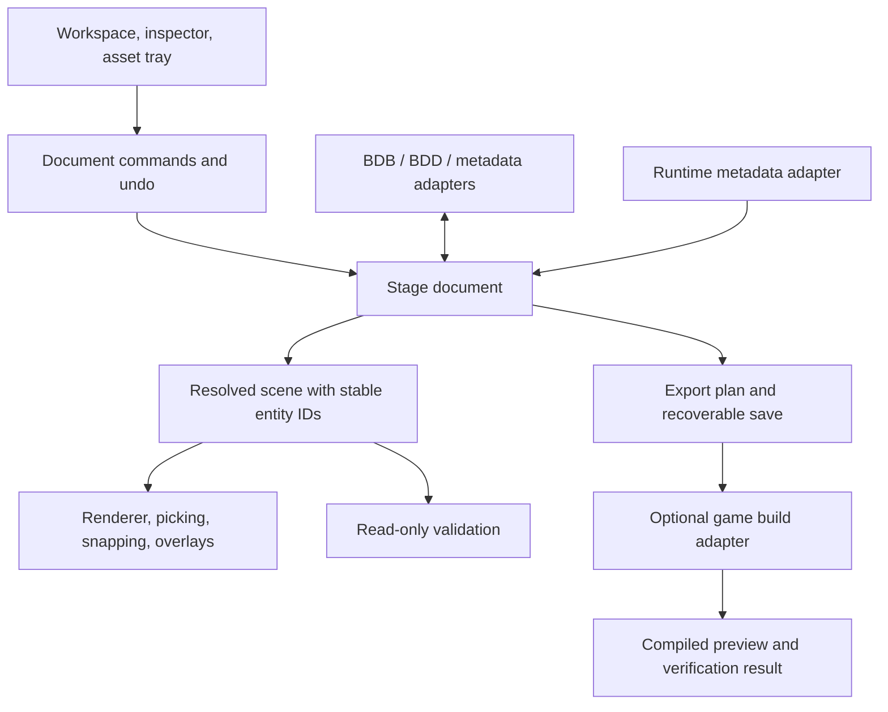

# BDD/BDB editor redesign assessment

**Recommendation: retain the format and asset-processing code, and rebuild the editing application around a unified stage document.** Replace the current workspace, canvas interaction, document state, and command handling. Extract the runtime interpretation into a testable service. A complete rewrite would discard useful, tested knowledge; a cosmetic UI pass would leave the main placement problems intact.

The first delivery should make one task dependable: open a stage, arrange artwork in its game composition, preview camera movement, undo changes, save, and reopen with the same result. Asset optimization, assembly repair, and ROM integration should support that task without occupying the everyday editing surface.

This recommendation is specifically weighted toward placing and arranging stage artwork to match the game. Confidence is high in the architectural direction, moderate in the exact workspace arrangement until it is tried interactively, and limited for emulator fidelity because no emulator comparison was performed.

## Scope and evidence

The source baseline is commit `95e4551`. Investigation began September 12, 2026; additional checks and the report were completed September 19. Application sources were unchanged during the assessment. The new files are documentation and an inventory; generated build and test material stays under `tmp/`.

The audit inventoried the tracked application, vendored dependencies, build and release workflows, local scripts, reference material, backups, and old binaries. Detailed source tracing covered loading, placement, projection, picking, runtime rendering, module ownership, document switching, undo, saving, defaults, tool routing, and integration commands. Python scripts were indexed by their definitions, imports, and descriptions, with closer inspection of the stage pipeline and renderers. Backup files and vendored libraries were inventoried rather than reviewed line by line. This is an architectural and workflow audit, not an exhaustive correctness review of every line.

| Area | Measured scope | Significance |
|---|---:|---|
| Tracked first-party C++/headers/Python/build scripts | 293 files; 67,158 lines | A substantial application, not a disposable prototype |
| `platform/Core/` | 59 files; 16,612 lines | Contains both reusable format code and editor-dependent logic |
| `platform/UI/` | 222 files; 44,941 lines | Most code is in the editor and its workflows |
| `platform/UI/tools/`, included above | 63 files; 19,843 lines | A large collection of tool-specific workflows |
| Local Python scripts | 39, of which 2 are tracked | Most helper workflows do not ship in a clean checkout |
| Local MAME Lua helpers | 14 | Useful experimental verification knowledge, with stage/build-specific assumptions |
| `platform/_local/` | 5 retired C++ tool files | Preserve as historical references; not part of the CMake application target |
| `backups/` | 1,343 files, approximately 124.5 MB | Recovery history; not a second source implementation |

Counts exclude vendored ImGui/stb from first-party totals and count lines including comments and blanks. See [the file inventory](UI_REDESIGN_INVENTORY.csv) for file-level classifications. The existing `screenshot.jpg` was inspected, but it depicts v1.0.12 and predates the current sidebar; current UI conclusions rely on source, not that screenshot alone.

## The main problem: editing and viewing different representations

BDB and BDD do not, on their own, specify the complete MK2 presentation. BDB contains placement and module rectangles; BDD contains indexed images and palettes. Game composition additionally depends on runtime plane placement, camera and scroll setup, display-list order, floors, and spawned actors. The current code already knows much of this, but exposes it through different views and tools.[^formats][^geometry]

There are at least four relevant coordinate spaces: source-sheet coordinates, coordinates local to a module, runtime stage coordinates, and camera-relative screen coordinates. They should be explicit inside the implementation. Everyday editing should present understandable stage and layer positions, with source packing available in a specialist workspace.

### 1. The drawn artwork can come from different data than the dragged artwork

When runtime/game view uses block-table rendering, `bdd_block_background_draw()` reads module `BLKS` records and draws their placements. The normal object loop skips background-plane BDB objects. Meanwhile the object drag path updates `g_obj[i].depth` and `g_obj[i].sy`. Those coordinates are not the block positions that the runtime background renderer reads.[^render][^drag]

**Consequence:** a BDB edit can fail to move the visible runtime artwork until derived game tables are regenerated, or leave the editable objects and visible composition out of sync. This is a traced code-path finding, not a claim that every drag in every view fails. The application already has stale-table diagnostics, which recognize part of this problem.

The replacement needs a live authoring scene rendered from current document state. A separately identified build preview should show compiled/generated output and its source revision. Editing must never silently operate on one representation while displaying the other as if it were current.

### 2. Moving a layer and moving a sprite have different persistence rules

Runtime module dragging calls `stage_bgnd_set_module_offset()`. That function rewrites a `.word` placement in an assembly file through `bgnd_commit()`, creates a backup, invalidates derived outputs, and refreshes the geometry cache. The destination is a per-stage draft when one exists, otherwise a discovered shared `BGND.ASM`.[^runtime-write]

This path is outside the normal BDB/BDD document transaction. The undo implementation contains snapshots and deltas for objects, module lines, palettes, image indices, and pixels, but no runtime assembly transaction. `ProjectSnapshot` does not contain the runtime assembly document. Thus the normal Ctrl+Z/save/discard model does not cover runtime placement writes in the same way it covers sprite movement.[^undo][^snapshot]

**Required behavior:** dragging a layer changes an in-memory layer transform and records one undo command. Saving persists the local project. Applying changes to an external game workspace is a separate explicit operation with a visible destination and build result. Runtime edits belong in the same undo and dirty-state model as artwork edits.

### 3. Source rectangle containment determines ownership

The format helpers find the first module that fully contains an object's image rectangle. The current preview drag code even reports when moving an object causes ownership to change. A source rectangle is consequently more than an ordinary visual group box; moving artwork across it can change what LOAD2 considers part of the module.[^formats][^drag]

This is why simply exposing more draggable boxes is insufficient. A stage editor should preserve an explicit layer/module assignment while arranging artwork. Export must deliberately map that assignment into valid source rectangles and local coordinates. Repacking existing stages requires a checked migration; it must not silently rewrite stock source layout on open.

### 4. “Layer” currently conflates different concepts

The layer panel groups objects by the high byte of `wx`. The presets explicitly describe this as paint/depth order, not the runtime scroll rate. Actual scroll rates are resolved from runtime module data when possible. Yet the fallback core function still supplies guessed scroll factors from depth-byte values, and module fallback uses its most common object depth.[^layers][^fallback]

The replacement must distinguish **runtime plane**, **object paint order**, and **organizational group**. Use readable names, but do not imply that a byte called “Sky” defines the game's sky plane. When metadata is missing, display an estimated preview state and allow explicit configuration. A heuristic must not be presented as verified game behavior.

### 5. Navigation and workspace structure make ordinary placement harder

Opening a stage explicitly resets game view and runtime layout off. The default is source editing, even though the desired task is game composition. `zoom_to_fit()` and selection fitting use integer zoom clamped to at least 1; a stage wider than the canvas cannot actually fit. The local Dead Pool compaction test measured source bounds of 2,365 × 2,078 pixels, so this is a practical limitation.[^open][^navigation]

The current fixed right sidebar improves on floating windows, but puts properties and object list in separate subtabs, assets in another tab, and layers in another section. The editor cannot expose the layer tree, asset choices, and inspector together in this column. Game view adds a separate tools window and a large camera-control panel; its geometry includes a hard-coded 188-pixel bottom reservation.[^sidebar][^game-controls][^projection]

A persistent stage tree, canvas, inspector, and collapsible asset tray would reduce repeated tab switching. Fractional zoom is a functional requirement; sharp integer zoom presets should remain available for pixel inspection.

## Additional findings that affect the rebuild

| Finding | Evidence and impact | Priority |
|---|---|---|
| Tool navigation contains stale numeric routing | Workflow sections define Check=2, Preview=3, Assets=4. `open_mk2_tool()` routes readiness/authoring entries to 3 and runtime-preview entries to 4. The labels can lead to an unrelated section. Replace magic numbers with named commands/routes. | High |
| Document tabs wrap a shared global workspace | `Document` contains a project snapshot, paths, and dirty flag. Runtime configuration, camera, and undo are not owned by that document structure. `doc_restore()` reloads the snapshot and runtime extras without restoring a per-document undo stack. Cross-document isolation needs dedicated tests. | High |
| A command queue exists, but is not the mutation boundary | `EditorCommandType` covers unsaved actions, save-all, verify/preferences, and opening tools. Placement and property edits commonly mutate global arrays directly. Adding panels does not solve this. | High |
| Rendering can mutate project structure | `bg_editor_render()` detects a larger object count and invokes `simple_ensure_module()` for newly added objects. Module assignment should be part of the placement command, with validation and undo, not an incidental effect of rendering. | High |
| Save protection is stronger per file than per project | Individual writers use temporary files and backups. `save_all_project()` saves the BDB and then the BDD; there is no encompassing transaction for the pair plus metadata/runtime state. Retain the safeguards and add recoverable project-level commit behavior. | High |
| Autosave is not a reliable elapsed-time guarantee | It counts rendered frames against `seconds × 60`, requires a BDB path, and runs after the render function's early return for distraction-free preview. Standalone asset documents and preview mode need explicit recovery coverage. | Medium |
| UI and Core boundaries are still porous | Three Core implementation files include the umbrella globals header; six directly include UI headers. `bdd_format.h` also exposes SDL types. Older refactoring notes claiming zero Core umbrella dependencies are stale for this checkout. | Medium |
| “Validation” can edit content | One-Click Validation defaults “Safe fixes” on and fits module bounds, sorts objects, and writes configuration/exports. Separate read-only checks from named, undoable repair commands. | Medium |
| Some integration actions prepare commands rather than execute workflows | `stage_run_command()` writes config and constructs a command, then reports that the external toolchain must be run manually. Its general path refers to ignored `tools/mk2_stage_kit.py`. A clean distribution cannot promise this as a working bundled feature. | Medium |

These findings come from the current implementations, not just the older planning documents.[^routing][^documents][^commands][^render-loop][^save][^autosave][^integration][^validation]

There is also meaningful positive evidence. Storage growth is centralized, the pure format implementation is shared with a headless CLI, raw RGB555 palette preservation exists, and difficult image edits have pixel-comparison smoke tests. Recent fixes address real projection and palette-sharing bugs. The rebuild should carry those protections forward.[^storage][^save][^tests][^changelog]

## What to retain, extract, replace, and retire

| Component | Decision | Boundary for the replacement |
|---|---|---|
| `bdd_core` parser/writer and format structures | Retain and expand characterization coverage | A C++ library with no UI, renderer, or global workspace dependency |
| RGB555 conversion, indexed images, palette handling | Retain algorithms and compatibility behavior | Typed assets, explicit image IDs, palette-per-placement preserved |
| IMG/TGA/PNG import and image-processing algorithms | Extract and retain selectively | Services return changes/errors; dialogs and undo stay outside them |
| LOAD2 diagnostics and size estimates | Retain rules; refactor execution | Structured issues with stable IDs, affected entities, severity, and suggested actions |
| Runtime parsing and projection knowledge | Extract, characterize, then simplify | Explicit input files, parsed metadata, deterministic transforms, and provenance |
| SDL rendering and texture caching | Reuse initially behind an interface | Draw a resolved scene; do not rediscover files or decide document ownership |
| Existing undo deltas and snapshots | Keep as migration references and regression fixtures | New per-document command history, including runtime properties |
| Global workspace and document switching | Replace | One owning document per tab; isolated camera, selection, history, and caches |
| Canvas input and coordinate conversions | Rebuild around common transforms | Rendering, picking, snapping, overlays, and export use the same resolved scene |
| Menus, toolbar, sidebar, game-view tool windows | Replace as one workspace design | A small everyday surface with contextual inspector and specialist workspaces |
| Numerous repair/readiness/palette panels | Consolidate | Checks, Optimize, Assets, and Runtime each have one home |
| Stage-specific builders and patchers | Preserve separately | Recipes or optional adapters with explicit prerequisites; not primary editor controls |
| Share bundle and wiki publishing | Retain outside the authoring core | Export/share only when invoked; no effect on ordinary editing |

Do not treat everything inside `platform/Core/` as an already independent engine. `bddtool` demonstrates a genuinely small reusable boundary: CMake builds it from the CLI and `bdd_core.cpp` without SDL or ImGui. The broader editor core still needs extraction.[^cmake]

### The local tools and scripts

The 39 Python scripts fall into the following complete groups; the inventory records their individual names, imports, and purposes.

| Group | Files | Recommended treatment |
|---|---:|---|
| Regression/open/save checks | 3 | Retain; promote valuable checks into tracked CI. The local regression baseline currently contains no fixtures. |
| Background/ROM analysis | 2 | Reuse domain rules and reports through structured diagnostics. |
| Source, runtime, and ROM preview renderers | 3 | Preserve as comparison references, then converge production rendering on a shared scene model. |
| Emulator capture, screenshot comparison, source/runtime validation | 4 | Keep as optional verification tools with recorded input/build versions. |
| Stage orchestration | 3 | Split generic build adapter from stage-specific recipe assumptions. |
| Asset preparation and stage builders, including legacy builder | 9 | Salvage tiling, palette grouping, placement recipes, and preprocessing. Move stage-specific compositions to examples/recipes. |
| Targeted imports, palette fixes, and bit-depth workarounds | 5 | Turn general operations into explicit services; preserve special-case scripts as historical evidence. |
| Promotion, wiring, space-reallocation, and repair scripts | 7 | Keep outside ordinary authoring; review as optional game-workspace adapters. |
| Movie encoder | 1 | Specialist runtime extension, not a prerequisite for arranging backgrounds. |
| Icon generator | 1 | Build/development utility. |
| Wiki publisher | 1 | Retain in publishing workflow. |

`mk2_stage_kit.py` looks generic at the command line but directly references portal-specific build and promotion scripts. `render_mk2_stage_preview.py` parses labels such as `orngbl_mod`, `orngbl_scroll`, and `dlists_orngbl`; it is not a universal MK2 renderer. Several scripts implement their own BDB/BDD readers, palette conversion, or projection. Reuse their hard-earned knowledge without making all of these implementations competing production backends.[^scripts]

The Lua helpers cover capture, first-match driving, fatality experiments, memory dumps, and probes. They contain fixed addresses and stage assumptions. They are useful candidates for a versioned emulator adapter and fixture generation, not default functionality to auto-run when opening a project.

## Proposed editing experience

Use three main workspaces: **Stage**, **Assets**, and **Build & Check**. Stage is the default for paired BDB/BDD files. A standalone BDD opens Assets directly. An optional **Source Layout** view remains available under advanced inspection for source rectangles, ordering, and packing.

```text
File   Edit   View                         Stage | Assets | Build & Check
[Open] [Save] [Undo] [Redo]      Select  Move  Place      Snap  Fit  Zoom
┌──────────────────┬────────────────────────────────┬──────────────────┐
│ Stage tree       │ Stage canvas                   │ Inspector        │
│                  │                                │                  │
│ Foreground       │ Artwork at authored runtime    │ Name / Layer     │
│ Fighters guide   │ positions; editable directly   │ Position X / Y   │
│ Floor            │                                │ Flip / Palette   │
│ Midground        │ Game frame and ground guide    │ Parallax / Order │
│ Background       │                                │ Context actions  │
│                  │ Start ─── camera scrub ─── End  │                  │
├──────────────────┴────────────────────────────────┴──────────────────┤
│ Assets: search · thumbnails · drag into the selected layer           │
├─────────────────────────────────────────────────────────────────────┤
│ Selection · coordinates · zoom · unsaved state · issues · preview state│
└─────────────────────────────────────────────────────────────────────┘
```

This is a proposed information hierarchy, not an implemented screen. At small widths, the asset tray collapses first and the tree can collapse next; the inspector and canvas must remain usable. Use restrained color, readable text, consistent spacing, explicit labels, and keyboard focus indicators. Icons should supplement familiar action names rather than replace discoverability.

### The everyday placement workflow

1. Open a BDB/BDD pair. Resolve available runtime metadata and show whether the composition is known or estimated. Fit the composed stage at any needed zoom, with the game frame visible.
2. Select a named plane in the stage tree. Expand it to see placements. Visibility, lock, and solo controls stay beside that plane.
3. Drag an asset from the tray into the stage. It lands in the chosen plane at the pointer, with a ghost preview and visible snapping guides.
4. Move artwork directly, nudge by one game pixel, duplicate with a modifier drag, align a group, or enter X/Y in the inspector. Selecting a whole plane moves its runtime transform; selecting a child changes that child's local position.
5. Scrub the camera without changing tools or opening another window. The canvas shows the same authored scene through the camera transform. Pause animated content while placing objects unless playback was explicitly started.
6. Undo, save, and reopen. The saved authoring scene must reproduce the composition without needing an agent to infer which additional files were changed.
7. Open Build & Check when ready. See validation, output freshness, the exact build target, and the last verification result. A compiled preview is visibly identified and can be compared with the authored scene.

For overlapping artwork, support cycling through hit candidates and selecting from the tree. Drawing and picking must use the same transforms, visibility rules, clipping, and draw order. Snapping can use visible pixels while format validation continues to use the full stored rectangle; those two purposes must stay distinct.

### Defaults

| Setting | Proposed default | Rationale |
|---|---|---|
| Workspace for a stage pair | Stage composition | Matches the primary editing task |
| Select/move and one-pixel positioning | Enabled | Fundamental editing should not require setup |
| Fit on first open | Enabled; restore later per-document camera | Makes the stage discoverable without discarding deliberate navigation |
| Fractional zoom | Enabled | Whole-stage editing must fit large layouts |
| Smart alignment guides and edge snapping | Enabled, with a temporary bypass | Helps arrangement without enforcing a coarse grid |
| Coarse grid snap | Off | Organic stage art is not necessarily a tile map |
| Game frame and ground guide | On, subtle | Useful references for placement |
| Module/source bounds | Selected layer only in Stage; available globally in Source Layout | Provides ownership context without covering every sprite |
| Per-object borders, labels, tint, debug overlays | Off except selection/hover | Keep the artwork legible |
| Runtime extras | Resolve available references as separate preview entities | Show relevant composition without importing preview-only assets into editable BDD content |
| Continuous checks | On, read-only and debounced | Make problems discoverable without silent mutation |
| Autosave/recovery | On using elapsed time, for every document type | Current preview mode and standalone BDD gaps must be fixed |
| Automatic optimization, recoloring, or assembly promotion | Off | These alter output and need deliberate actions with reviewable consequences |
| Simple/Advanced application-wide mode | Remove | Reveal specialist fields locally instead of hiding whole workflows |

These are proposed behaviors, not merely boolean changes to the existing implementation. For example, enabling the current runtime autoload switch globally before separating preview assets from authored content would preserve the present coupling. Similarly, “smart snap” needs consistent canvas behavior rather than just enabling a grid.

## Target architecture



**Document ownership.** A `StageDocument` owns assets, palettes, placements, source modules, runtime planes, camera/start settings, metadata provenance, dirty state, and history. Asset IDs, object IDs, module IDs, and plane IDs should be distinct types. Current array indices and external image/header IDs must not become interchangeable merely because they are integers.

**One evaluated scene.** Resolve a scene once per relevant document revision. Each visible instance has an identity, source provenance, transform, palette, bounds, clipping, draw rank, and editing capability. Cache parsed runtime tables by explicit input identity and revision. Rendering and hit-testing consume this scene rather than repeating path discovery, source containment, and projection independently.

**One editing boundary.** Commands such as `MoveObjects`, `MovePlane`, `AssignPalette`, `SetParallax`, `ImportAsset`, and `SetCameraStart` validate and modify the document. Dragging previews a command continuously, commits once on release, and cancels on Escape. All UI routes invoke the same command. Drawing is read-only.

**Two kinds of preview with explicit status.** Authoring preview renders current unsaved document state. Build preview renders a known generated artifact and records its input revision. Missing metadata produces an estimated state; stale output produces a stale state; emulator capture produces a verification record for one specific build and camera. A successful PNG export does not mean the stage has been verified in-game.

**Persistence.** Keep BDB and BDD compatibility. Introduce or consolidate a versioned local project sidecar for semantics those formats cannot represent: explicit plane bindings, editor organization, runtime settings, and linked assets. Do not silently replace existing `.BDD.meta`, runtime JSON, stage config, or draft assembly. Migrate through documented adapters and retain unknown external content where possible.

**Export.** Preserve existing source rectangles when possible. When authoring requires repacking, calculate source-sheet placement and runtime mapping as an export plan, validate first-fit containment and LOAD2 ordering, and show meaningful changes. Individual temporary-file replacement is useful, but a multi-file save also needs a manifest/journal and recovery from partial completion; do not promise filesystem-wide atomicity.

**External integration.** A future build adapter should declare required tools, source inputs, output locations, and supported game version. It can run jobs off the UI thread and report progress. The first stage-editing release does not need to reproduce every local ROM patcher.

## Toolkit decision

The code supports a clear decision about reuse now. It does not establish that replacing the UI toolkit is necessary.

| Approach | Assessment |
|---|---|
| Restyle existing panels | Insufficient. Retains split state, independent input paths, and inconsistent persistence. |
| Rebuild the editor/document layer using retained C++ code and SDL/ImGui initially | Recommended first path. Reuses rendering and packaging while making the editing model independent of the UI. |
| Reuse the same extracted core with a Qt desktop UI | Credible alternative if native desktop conventions, accessibility, or richer document widgets become firm requirements. Still requires the document/scene extraction. |
| Web UI over a native backend | A possible later product choice, but adds a bridge, packaging work, and another state boundary without resolving the current placement semantics by itself. |
| Rewrite all format, runtime, and editing code from scratch | Highest compatibility risk, with no demonstrated benefit for the main problem. |

Dear ImGui supports substantial editor interfaces and has an upstream docking branch. The repository vendors v1.91.0 without docking APIs. A fixed, resizable workspace can be built without making a docking upgrade part of the first milestone. Upstream explicitly notes limits around accessibility and full internationalization; those would be reasons to revisit the toolkit choice.[^imgui]

Qt provides a scene/view framework, model/view widgets, and command-based undo examples. Those are relevant capabilities, but they do not automatically solve this application's runtime mapping or export semantics. Evaluate a Qt shell only against a small real editing slice after the reusable core boundary exists. The recommendation to start with the present native stack is an engineering judgment based on migration risk, not a benchmark proving it superior.[^qt]

## Verification performed and its limits

A clean Windows Release build of both executables succeeded in `tmp/ui-audit-build/`, using the installed MSVC toolchain and cached SDL2 2.32.10. The source checkout was not modified to get the build passing. Existing tests were run against those fresh executables.

| Check | Result | What it establishes |
|---|---|---|
| Roundtrip script: generated checker and local Dead Pool fixture | Passed | BDB semantic diff was empty and BDD bytes were identical after save/reload |
| PNG import RGB555 probe | Passed | Existing import/save color-conversion check passed |
| Open-mode script | Passed | BDB/pair opens in stage mode; standalone BDD in image-grid mode |
| Module-pick smoke: both fixtures | Passed | Existing module projection/picker assertions passed; Dead Pool reported 5 runtime-placed/block-backed modules but 0 object-overlap checks |
| Undo-move smoke: both fixtures | Passed | Existing object/module/palette/image delta undo and redo checks passed; checker has no multi-object mask case |
| Split-object smoke: both fixtures | Passed | Rendered source composite was unchanged, including flip variants; undo restored it |
| Palette-compaction smoke: both fixtures | Passed | Dead Pool exercised 27 cross-palette placements; no composite pixels changed |
| Empty-project save/reopen smoke | Passed | Empty BDB/BDD pairs reopen |
| Headless game PNG output: both fixtures | Produced 400 × 254 PNGs | Renderer executes; this is not a fidelity assertion |

One result is especially useful for scope: the split test reduced image bytes in the Dead Pool fixture from 113,963 to 113,558, but increased total estimated payload from `0x1CAB7` to `0x1CBCA` as placements grew. “Optimization succeeded” and “the stage got smaller” are different statements. The new Optimize surface should show both image savings and total runtime/storage cost.

The Dead Pool game PNG was visually fragmented, with disconnected pieces and large gaps. The fixture may be modified or inconsistent with discovered runtime tables; this audit did not prove the cause. The separate MK2 diagnostic reported one hard issue and five cautions, and `bgndtbl_checked=0`. Therefore passing the format validator and smoke tests must not be interpreted as a clean stage or a correct game preview. This observed case should become a provenance/freshness regression scenario before the new canvas is accepted.

Logs are in `tmp/ui-audit-build/roundtrip.log` and `tmp/ui-audit-tests/`; the supplemental command results are in `tmp/ui-audit-tests/checks.json`. Local captures and fixtures remain ignored and are not included in the report or source inventory as embedded assets.

No interactive desktop usability session, MAME comparison, ROM rebuild, malformed-input fuzz campaign, or cross-platform build was performed. The existing source-based defects and workflow analysis are identified as such. Current CI covers Linux/macOS builds and basic generated/roundtrip checks; the additional placement/edit smokes are not all exercised there. Windows checks appear in the release workflow.[^ci]

## Implementation sequence and acceptance gates

Do this in vertical slices. A usable placement workflow should arrive before porting every specialist tool.

| Milestone | Concrete work | Acceptance gate |
|---|---|---|
| 1. Preserve behavior and establish scene identity | Extract `bdd_core` as a library target; add synthetic multi-plane, shared-palette, missing-metadata, and stale-table fixtures; define IDs and provenance | Existing format/edit tests pass; missing/stale runtime data is detected and represented explicitly |
| 2. Build one real editing slice | Introduce `StageDocument`, commands, and resolved scene for loading, selecting, moving, duplicating, undoing, and saving a stage | A visible sprite follows the pointer; hit-test agrees with drawing; undo and reopen restore the same placement |
| 3. Replace the workspace | Add stage tree, canvas, inspector, asset tray, fractional zoom, context actions, and camera scrub | Arrange a stage without opening a diagnostic window or switching through nested sidebar tabs |
| 4. Own runtime properties | Move plane transforms, parallax, draw order, start camera, and ground settings into document commands and sidecar persistence | These edits undo correctly, survive reopen, and do not write shared game assembly during dragging |
| 5. Consolidate tools | Migrate asset operations; introduce one Checks surface and one Optimize surface; separate analysis from repairs | Every issue can locate affected content; a repair is one named undoable action; optimization shows complete costs |
| 6. Add verified export/integration | Introduce explicit export plans, optional build adapter, stale-build detection, and matched emulator comparisons | Authored and built output can be compared at start/middle/end camera positions with recorded inputs |
| 7. Retire duplicate paths | Remove old canvas handlers, redundant panels, and obsolete flags after feature parity is demonstrated | One active placement implementation and one command route per action |

The first slice should include both a synthetic scene and the existing local fixture. A synthetic success alone will miss the source/runtime mismatch that makes real stages difficult.

Required behavioral tests should cover: moving an object at several camera offsets and parallax rates; selecting the top visible overlapping item; locked content resisting every mutation route; a plane move preserving source ownership; explicit object reassignment; preview-only actors staying out of BDD saves; per-document undo isolation; missing external metadata; stale tables after a local edit; interrupted multi-file save recovery; and one-pixel alignment at fractional zoom. These tests protect the editing contract, rather than snapshotting button layouts.

Treat emulator fidelity as a separate acceptance gate. Compare authored and built images at defined camera/time positions, account for fighters and animated regions, and verify the exact packaged build. Keep the current runtime parser's special cases until those comparisons justify removing them.

## Decision

Proceed with **core reuse plus a rebuilt editor/document layer**. Start with the native stack already in the repository, but put a real API between it and the stage model. Make the game composition the normal editing surface, keep source packing inspectable, and make all artwork and runtime-property edits follow one command/save/undo contract.

The first implementation should be an end-to-end placement editor. Porting the existing collection of panels into a newer-looking shell would reproduce the same workarounds and the same need for agents to bridge them.

## Sources

Local sources below refer to the audited checkout. Function names identify the relevant implementation; the inventory includes source hashes to make later drift visible. External framework documentation was consulted September 12, 2026.

[^formats]: [bdd_core.h](../platform/Core/bdd_core.h), [bdd_core.cpp](../platform/Core/utils/bdd_core.cpp), [bdd_format.h](../platform/Core/bdd_format.h): BDB/BDD structures, full-rectangle module ownership, format limits, conversion and I/O. [Existing background research](../mk2_background_deep_dive.md) supplies historical context; its recommendations were checked against current code rather than assumed current.
[^geometry]: [viewer_geometry.cpp](../platform/Core/viewer_geometry.cpp): `bdd_object_runtime_origin`, stage-plane parsing, `bdd_object_game_scroll_factor`, floor and draw-rank handling.
[^render]: [sdl_world_objects.cpp](../platform/UI/sdl/sdl_world_objects.cpp): `bdd_block_background_draw` and the `block_bg` branch in `bdd_world_objects_draw`.
[^drag]: [game_view_overlay.cpp](../platform/UI/overlays/game_view_overlay.cpp): object-drag updates to `depth`/`sy`, module dragging, ownership-change reporting.
[^runtime-write]: [mk2_palette_sync_prompt.cpp](../platform/UI/tools/mk2_palette_sync_prompt.cpp): `stage_start_find_bgnd_path`, `bgnd_commit`, `stage_bgnd_set_module_offset`.
[^undo]: [undo_manager.cpp](../platform/undo_manager.cpp), [undo_manager.h](../platform/undo_manager.h): supported undo kinds and snapshot/delta history.
[^snapshot]: [project_snapshot.h](../platform/Core/project_snapshot.h), [project_snapshot.cpp](../platform/Core/project_snapshot.cpp): snapshot contents and capture/restore.
[^layers]: [mk2_layer_presets.cpp](../platform/UI/tools/mk2_layer_presets.cpp), [layers_panel.cpp](../platform/UI/panels/layers_panel.cpp): depth-byte labels and grouping.
[^fallback]: [bdd_core.cpp](../platform/Core/utils/bdd_core.cpp): `bdd_core_mk2_scroll_factor`; [viewer_geometry.cpp](../platform/Core/viewer_geometry.cpp): module-majority fallback.
[^open]: [stage_open.cpp](../platform/UI/app/stage_open.cpp): `enter_edit_layout_after_stage_load`; [viewer_stage_io.cpp](../platform/Core/viewer_stage_io.cpp): `bdd_viewer_enter_edit_layout_after_bdb_load`.
[^navigation]: [navigation.cpp](../platform/UI/view/navigation.cpp): integer zoom and fit functions.
[^sidebar]: [right_sidebar.cpp](../platform/UI/view/right_sidebar.cpp): section/subtab structure, sizes, persistence.
[^game-controls]: [game_view_controls.cpp](../platform/UI/view/game_view_controls.cpp): game-view tools and camera-control layout.
[^projection]: [world_view_helpers.cpp](../platform/UI/view/world_view_helpers.cpp): screen rectangles and reserved viewport space.
[^routing]: [mk2_workflow.cpp](../platform/UI/tools/mk2_workflow.cpp): section enumeration; [stage_open.cpp](../platform/UI/app/stage_open.cpp): `open_mk2_tool`; [menu_bar.cpp](../platform/UI/panels/menu_bar.cpp): tool IDs.
[^documents]: [document_tabs.cpp](../platform/UI/panels/document_tabs.cpp): `doc_save`/`doc_restore`; [bg_editor_globals.h](../platform/bg_editor_globals.h): `Document` and shared state.
[^commands]: [editor_commands.h](../platform/Core/editor_commands.h), [editor_command_processor.cpp](../platform/UI/app/editor_command_processor.cpp): command queue scope.
[^render-loop]: [editor_render.cpp](../platform/UI/app/editor_render.cpp): lazy module enforcement and preview early return.
[^save]: [viewer_save.cpp](../platform/Core/viewer_save.cpp), [save_project.cpp](../platform/UI/app/save_project.cpp): temporary files, backups, palette cache, and sequential project save.
[^autosave]: [autosave.cpp](../platform/UI/app/autosave.cpp): frame-count timing and path guard; [bg_editor.cpp](../platform/bg_editor.cpp) and [editor_project_globals.cpp](../platform/Core/editor_project_globals.cpp): current defaults.
[^integration]: [mk2_stage_config.cpp](../platform/UI/tools/mk2_stage_config.cpp): `stage_build_command` and `stage_run_command`; [.gitignore](../.gitignore): unshipped local tooling.
[^validation]: [mk2_one_click_validation_run.cpp](../platform/UI/tools/mk2_one_click_validation_run.cpp), [mk2_analysis.cpp](../platform/Core/mk2_analysis.cpp): mutations within validation workflow and diagnostic implementation.
[^storage]: [editor_project_storage.cpp](../platform/Core/editor_project_storage.cpp): capacity-managed project storage; [image_processing.cpp](../platform/Core/image_processing.cpp): palette and image operations.
[^tests]: [roundtrip_smoke.py](../tools/roundtrip_smoke.py), [viewer_stage_io.cpp](../platform/Core/viewer_stage_io.cpp), [viewer_cli_commands.cpp](../platform/Core/viewer_cli_commands.cpp): smoke implementations. Observed results are recorded in the Verification section and local ignored logs.
[^changelog]: [CHANGELOG.md](../CHANGELOG.md): unreleased projection, split-object, palette-compaction, and sidebar changes. Historical test claims were not substituted for this audit's runs.
[^cmake]: [CMakeLists.txt](../CMakeLists.txt), [build.ps1](../build.ps1), [CONTRIBUTING.md](../CONTRIBUTING.md): current build boundaries and conventions.
[^scripts]: Local ignored sources: `tools/mk2_stage_kit.py`, `tools/render_mk2_stage_preview.py`, `tools/render_bgproof_mk2.py`, `tools/regression_check.py`, `tools/regression_baseline.json`, and the other files indexed in [UI_REDESIGN_INVENTORY.csv](UI_REDESIGN_INVENTORY.csv). These files are present locally and are not promised as part of a clean public checkout.
[^imgui]: Repository [imgui.h](../imgui/imgui.h), v1.91.0; upstream Dear ImGui [README](https://github.com/ocornut/imgui/blob/master/docs/README.md) and [Docking documentation](https://github.com/ocornut/imgui/wiki/Docking).
[^qt]: Qt documentation: [Graphics View Framework](https://doc.qt.io/qt-6/graphicsview.html), [Model/View Programming](https://doc.qt.io/qt-6/model-view-programming.html), and [Undo Framework Example](https://doc.qt.io/qt-6/qtwidgets-tools-undoframework-example.html).
[^ci]: [CI workflow](../.github/workflows/ci.yml), [Release workflow](../.github/workflows/release.yml), and [Publish-stage workflow](../.github/workflows/publish-stage.yml).
